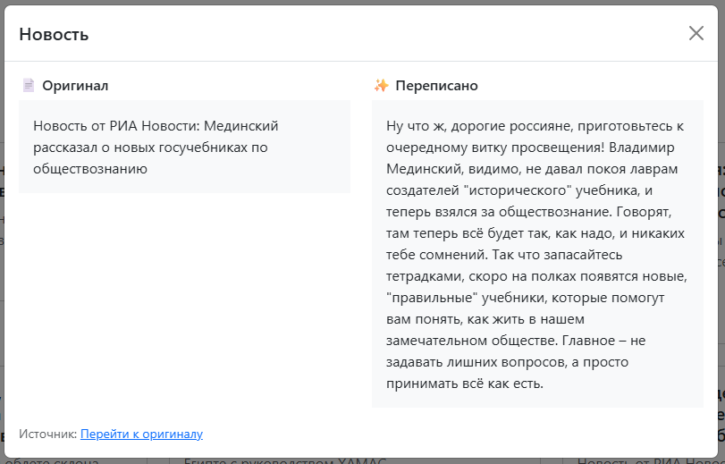
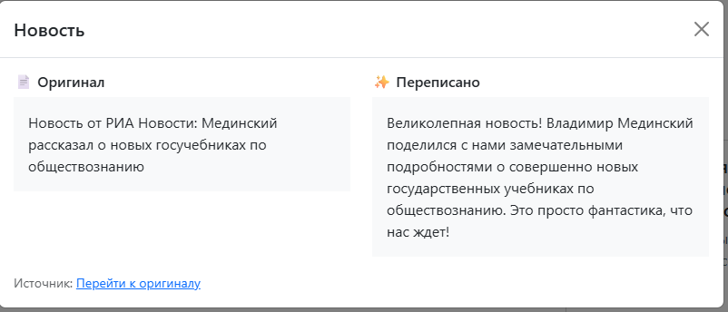

# 📰 Новости с настроением

Веб-приложение на Laravel, которое берёт реальные новости из открытых RSS-источников и переписывает их под выбранное эмоциональное настроение (нейтрально, радостно, грустно, иронично, оптимистично), сохраняя все факты неизменными.

---

## Содержание

- [Скриншоты](#скриншоты)
- [Стек](#стек)
- [Как устроено приложение](#как-устроено-приложение)
- [Откуда берутся новости](#откуда-берутся-новости)
- [Как устроено хранение данных](#как-устроено-хранение-данных)
- [Как переписывается тон](#как-переписывается-тон)
- [Как проверяется сохранение фактов](#как-проверяется-сохранение-фактов)
- [Кэширование](#кэширование)
- [Запуск через Docker](#запуск-через-docker)
- [Запуск без Docker](#запуск-без-docker)
- [Переменные окружения](#переменные-окружения)
- [Что использовали из AI](#что-использовали-из-ai)
- [Известные ограничения](#известные-ограничения)

---

## Скриншоты

| Главная страница (грид новостей) | Модальное окно сравнения |
|---|---|
|  |  |


---

## Стек

- **Backend:** PHP 8.2+, Laravel
- **База данных:** PostgreSQL
- **Кэш:** Laravel Cache (Redis в Docker-окружении)
- **Источники новостей:** RSS (РИА Новости, ТАСС, Ведомости, Lenta.ru)
- **Переписывание тона:** OpenRouter API (модель `google/gemini-2.5-flash-lite`)
- **Frontend:** Blade + Bootstrap 5 (без сборки фронтенда, всё через CDN)
- **Контейнеризация:** Docker, Docker Compose

---

## Как устроено приложение

1. Artisan-команда `news:fetch` дергает `NewsParserService`, которая обходит список RSS-источников, парсит по 10 последних новостей из каждого и сохраняет их в таблицу `news` (дубликаты по `source_url` пропускаются).
2. Главная страница (`GET /`) выводит последние 20 новостей гридом карточек.
3. Над гридом — селектор настроения (`neutral`, `joyful`, `sad`, `ironic`, `optimistic`).
4. Клик по карточке уходит на `GET /news/{id}?mood=...`, который:
   - если переписанная версия для этого настроения уже сохранена в БД — отдаёт её сразу, без обращения к AI;
   - если нет — вызывает `NewsRewriterService`, который обращается к OpenRouter, получает переписанный текст, сохраняет его в БД и в кэш;
5. В модальном окне показываются рядом оригинальный и переписанный текст, а также ссылка на источник.

---

## Откуда берутся новости

Новости парсятся из публичных RSS-лент:

| Источник | URL |
|---|---|
| РИА Новости | `https://ria.ru/export/rss2/index.xml` |
| ТАСС | `https://tass.ru/rss/v2.xml` |
| Ведомости | `https://www.vedomosti.ru/rss/news` |
| Lenta.ru | `https://lenta.ru/rss` |

Список источников задан в `App\Services\NewsParserService::$sources` — можно добавить свои, добавив элемент `['name' => ..., 'url' => ...]`.

Для каждой новости сохраняется:
- заголовок (`title`);
- текст (`content`) — берётся из `<content:encoded>`, если его нет — из `<description>`, если и его нет — генерируется короткое описание из заголовка (`generateDescription`);
- ссылка на оригинал (`source_url`);
- название источника (`source_name`);
- дата публикации (`published_at`), распарсенная из `<pubDate>`.

Чтобы получить новые новости, нужно запускать команду:

```bash
php artisan news:fetch
```

В Docker-окружении эта команда запускается автоматически по расписанию (см. ниже, [scheduler в docker-compose](#запуск-через-docker)).

---

## Как устроено хранение данных

Новости хранятся в PostgreSQL, таблица `news`:

| Поле | Тип | Описание |
|---|---|---|
| `id` | bigint | первичный ключ |
| `title` | string | заголовок новости |
| `content` | text | оригинальный текст новости |
| `source_url` | string, unique | ссылка на оригинал (используется для дедупликации) |
| `source_name` | string | название источника |
| `published_at` | timestamp | дата публикации |
| `rewritten_versions` | jsonb | переписанные версии по настроениям, вида `{"joyful": "...", "sad": "..."}` |

Переписанные версии не хранятся в отдельной таблице, а складываются в один JSON-столбец `rewritten_versions` — это позволяет не переписывать новость повторно через AI, если версия для нужного настроения уже когда-то была сгенерирована (см. методы `getRewrittenVersion` / `setRewrittenVersion` / `hasRewrittenVersion` в модели `News`).

---

## Как переписывается тон

За переписывание отвечает `App\Services\NewsRewriterService`:

1. Сначала проверяется, нет ли уже сохранённой версии в `rewritten_versions` — если есть, она возвращается сразу.
2. Затем проверяется кэш (`Cache::get`) по ключу `news_rewrite_{id}_{mood}`.
3. Если нигде нет — делается запрос к OpenRouter (`POST /api/v1/chat/completions`) с моделью `google/gemini-2.5-flash-lite`.
4. Модели даётся системный промпт:

   > «Ты — профессиональный редактор новостей. Переписываешь новости в заданном тоне, сохраняя все факты. Отвечай только переписанным текстом.»

   и пользовательский промпт с явным требованием:

   > «Перепиши следующий новостной текст в {mood} тоне. Сохрани все факты без изменений: имена, даты, числа, названия, цитаты. Не добавляй вымышленных фактов. Измени только эмоциональную окраску.»

5. Результат сохраняется в БД (в `rewritten_versions`) и кэшируется на 1 час (`Cache::put(..., 3600)`).

Доступные настроения (`NewsRewriterService::MOODS`):

```php
'neutral'     => 'нейтрально',
'joyful'      => 'радостно',
'sad'         => 'грустно',
'ironic'      => 'иронично',
'optimistic'  => 'оптимистично',
```

---

## Как проверяется сохранение фактов

Полностью автоматической фактчекинг-системы (сравнение сущностей до/после) в проекте нет — контроль фактов реализован в три уровня:

1. **Промпт-инженерия.** Модели явно и многократно указывается не менять имена, даты, числа, названия и цитаты, а менять только эмоциональную окраску текста. Температура генерации намеренно невысокая (`temperature: 0.7`), `max_tokens` ограничен (500), чтобы модель не «расписывалась» и не добавляла лишнего.
2. **Ручная проверка при тестировании.** При тестировании каждая переписанная версия сверялась построчно с оригиналом на предмет совпадения имён, чисел, дат и цитат — это ручной процесс, не автоматизированный.
3. **Идемпотентность через хранение.** Так как переписанная версия сохраняется в БД (`rewritten_versions`) и больше не перегенерируется, риск «расхождения фактов» при повторных запросах отсутствует — текст, прошедший проверку один раз, остаётся неизменным.

**Известное ограничение:** автоматической валидации (например, сверки чисел/дат регулярными выражениями или NER-моделью) в MVP нет. Как следующий шаг это можно добавить — например, извлекать все числа/даты из оригинала регулярным выражением и проверять, что они присутствуют в переписанном тексте, прежде чем сохранять результат.

---

## Кэширование

Используется стандартный `Cache` фасад Laravel:
- Ключ: `news_rewrite_{news_id}_{mood}`;
- TTL: 3600 секунд (1 час);
- Назначение: снизить число обращений к OpenRouter при повторных запросах в течение сессии, до того как результат зафиксируется в БД.

В Docker-окружении в качестве драйвера кэша используется **Redis** (см. `.env` → `CACHE_STORE=redis`). Локально без Docker можно использовать `file` или `database` — регулируется той же переменной.

---

## Запуск через Docker

### Требования
- Docker и Docker Compose
- Ключ OpenRouter API (`OPENROUTER_API_KEY`)
- **Рабочий VPN**, если запускаете из региона, где `openrouter.ai` заблокирован или недоступен напрямую — без этого запросы на переписывание тона будут падать по таймауту/ошибке соединения (в логах это будет видно как `API exception`).

### Шаги

1. Склонируйте репозиторий и перейдите в папку проекта:
   ```bash
   git clone https://github.com/waxfe/news-app
   cd <папка-проекта>
   ```

2. Скопируйте `.env.example` в `.env`:
   ```bash
   cp .env.example .env
   ```

3. Настройте .env файл:
   ```dotenv
   APP_URL=http://localhost:8000

    DB_CONNECTION=pgsql
    DB_HOST=db
    DB_PORT=5432
    DB_DATABASE=news-app
    DB_USERNAME=postgres
    DB_PASSWORD=postgres

    OPENROUTER_API_KEY=sk-or-v1-ваш_ключ
   ```
   Получить ключ можно на [openrouter.ai](https://openrouter.ai/keys) (нужен VPN для доступа к сайту/API из РФ).

4. Соберите и поднимите контейнеры:
   ```bash
   docker compose up -d --build
   ```

5. Установите зависимости и подготовьте приложение (выполняется внутри контейнера `app`):
   ```bash
   docker compose exec app composer install
   docker compose exec app php artisan key:generate
   docker compose exec app php artisan migrate
   ```

6. Загрузите первые новости:
   ```bash
   docker compose exec app php artisan news:fetch
   ```

7. Откройте приложение: [http://localhost:8000](http://localhost:8000)

Дальше новости будут подтягиваться автоматически по расписанию (каждый час) через сервис `scheduler` в `docker-compose.yml`, который запускает `php artisan schedule:work`. Расписание задачи `news:fetch` определяется в `routes/console.php` или `app/Console/Kernel.php` (в зависимости от версии Laravel):

```php
Schedule::command('news:fetch')->hourly();
```

Чтобы обновить новости вручную в любой момент:
```bash
docker compose exec app php artisan news:fetch
```

### Сервисы в docker-compose

| Сервис | Назначение | Порт |
|---|---|---|
| `app` | PHP-FPM, приложение Laravel | — |
| `nginx` | веб-сервер, отдаёт приложение | `8000:80` |
| `db` | PostgreSQL | `5432:5432` |
| `redis` | кэш | `6379:6379` |
| `scheduler` | запускает `php artisan schedule:work` для автообновления новостей | — |

---

## Запуск без Docker

1. `composer install`
2. `cp .env.example .env` и заполнить `DB_*`, `OPENROUTER_API_KEY`
3. `php artisan key:generate`
4. Поднять локальный PostgreSQL, создать БД
5. `php artisan migrate`
6. `php artisan news:fetch`
7. `php artisan serve`

---

## Переменные окружения

Ключевые переменные из `.env`:

```dotenv
APP_URL=http://localhost:8000

DB_CONNECTION=pgsql
DB_HOST=db
DB_PORT=5432
DB_DATABASE=news_moods
DB_USERNAME=postgres
DB_PASSWORD=postgres

CACHE_STORE=redis
REDIS_HOST=redis
REDIS_PORT=6379

OPENROUTER_API_KEY=sk-or-v1-...
```

> ⚠️ Обращения к OpenRouter API требуют доступа к `openrouter.ai` — из РФ это, как правило, работает только через VPN. Если видите в логах `API exception` с сетевой ошибкой (connection timeout / could not resolve host) — в первую очередь проверьте VPN, а не ключ.

---

## Что использовали из AI

- **OpenRouter API, модель `google/gemini-2.5-flash-lite`** — для переписывания текстов новостей под заданное настроение (продовое использование в самом приложении).
- Инструменты на основе Claude использовались как ассистент при написании и отладке части кода.

---